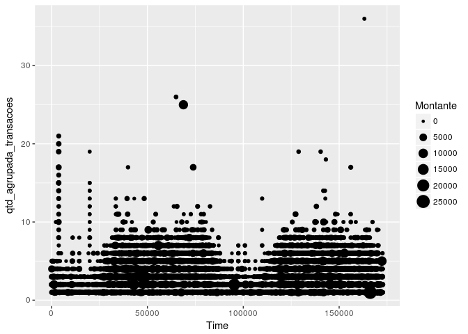
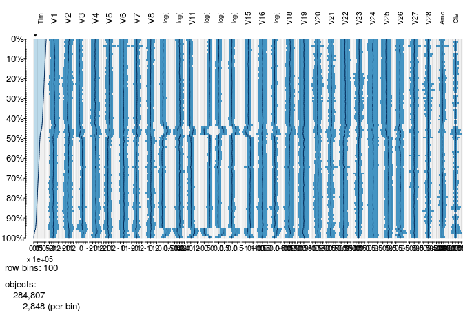
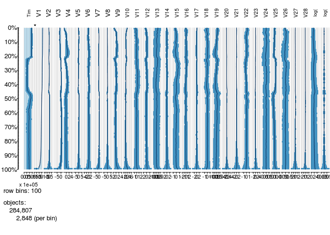
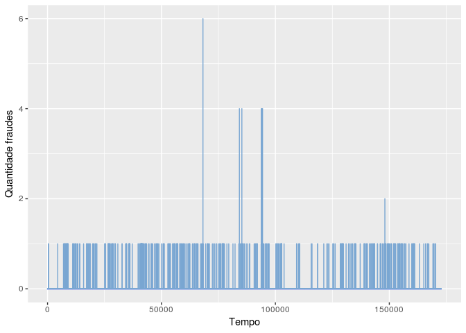
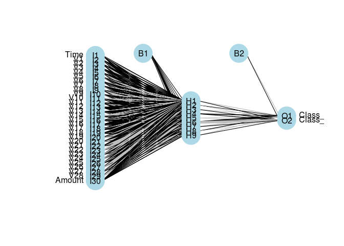

Análise Fraude
================
Sayuri Takeda
Junho de 2018

-   [Objetivo](#objetivo)
-   [Metodologia](#metodologia)
    -   [Análise exploratória](#análise-exploratória)
    -   [Modelagem](#modelagem)
        -   [Regressão Logistica](#regressão-logistica)
        -   [Adaboosting](#adaboosting)
        -   [Redes Neurais](#redes-neurais)
-   [Conclusão](#conclusão)

Objetivo
========

O objetivo deste trabalho será detectar fraudes na base Credit Card Fraud Detection do [Kaggle](https://www.kaggle.com/mlg-ulb/creditcardfraud) demonstrando alguns classificadores.

Metodologia
===========

Inicialmente iremos fazer uma análise exploratória dos dados afim de estudar como a base se comporta.

Em seguida iremos rodar os algoritmos regressão logistica, redes neurais e adaboosting calculando a sensibilidade para cada método, lembrando que, quanto **maior a sensibidade** melhor.

Análise exploratória
--------------------

A base contém 31 colunas, sendo a coluna Time os segundos no período de 2 dias.

    ##   Time         V1          V2        V3         V4          V5          V6
    ## 1    0 -1.3598071 -0.07278117 2.5363467  1.3781552 -0.33832077  0.46238778
    ## 2    0  1.1918571  0.26615071 0.1664801  0.4481541  0.06001765 -0.08236081
    ## 3    1 -1.3583541 -1.34016307 1.7732093  0.3797796 -0.50319813  1.80049938
    ## 4    1 -0.9662717 -0.18522601 1.7929933 -0.8632913 -0.01030888  1.24720317
    ## 5    2 -1.1582331  0.87773675 1.5487178  0.4030339 -0.40719338  0.09592146
    ## 6    2 -0.4259659  0.96052304 1.1411093 -0.1682521  0.42098688 -0.02972755
    ##            V7          V8         V9         V10        V11         V12
    ## 1  0.23959855  0.09869790  0.3637870  0.09079417 -0.5515995 -0.61780086
    ## 2 -0.07880298  0.08510165 -0.2554251 -0.16697441  1.6127267  1.06523531
    ## 3  0.79146096  0.24767579 -1.5146543  0.20764287  0.6245015  0.06608369
    ## 4  0.23760894  0.37743587 -1.3870241 -0.05495192 -0.2264873  0.17822823
    ## 5  0.59294075 -0.27053268  0.8177393  0.75307443 -0.8228429  0.53819555
    ## 6  0.47620095  0.26031433 -0.5686714 -0.37140720  1.3412620  0.35989384
    ##          V13        V14        V15        V16         V17         V18
    ## 1 -0.9913898 -0.3111694  1.4681770 -0.4704005  0.20797124  0.02579058
    ## 2  0.4890950 -0.1437723  0.6355581  0.4639170 -0.11480466 -0.18336127
    ## 3  0.7172927 -0.1659459  2.3458649 -2.8900832  1.10996938 -0.12135931
    ## 4  0.5077569 -0.2879237 -0.6314181 -1.0596472 -0.68409279  1.96577500
    ## 5  1.3458516 -1.1196698  0.1751211 -0.4514492 -0.23703324 -0.03819479
    ## 6 -0.3580907 -0.1371337  0.5176168  0.4017259 -0.05813282  0.06865315
    ##           V19         V20          V21          V22         V23
    ## 1  0.40399296  0.25141210 -0.018306778  0.277837576 -0.11047391
    ## 2 -0.14578304 -0.06908314 -0.225775248 -0.638671953  0.10128802
    ## 3 -2.26185710  0.52497973  0.247998153  0.771679402  0.90941226
    ## 4 -1.23262197 -0.20803778 -0.108300452  0.005273597 -0.19032052
    ## 5  0.80348692  0.40854236 -0.009430697  0.798278495 -0.13745808
    ## 6 -0.03319379  0.08496767 -0.208253515 -0.559824796 -0.02639767
    ##           V24        V25        V26          V27         V28 Amount Class
    ## 1  0.06692807  0.1285394 -0.1891148  0.133558377 -0.02105305 149.62     0
    ## 2 -0.33984648  0.1671704  0.1258945 -0.008983099  0.01472417   2.69     0
    ## 3 -0.68928096 -0.3276418 -0.1390966 -0.055352794 -0.05975184 378.66     0
    ## 4 -1.17557533  0.6473760 -0.2219288  0.062722849  0.06145763 123.50     0
    ## 5  0.14126698 -0.2060096  0.5022922  0.219422230  0.21515315  69.99     0
    ## 6 -0.37142658 -0.2327938  0.1059148  0.253844225  0.08108026   3.67     0

A base é bem desbalanceada, apenas 0.17% da base são fraudes.

Abaixo segue tabela com montante em classes e percentual de fraudes para cada classe:

<table class="table table-condensed">
<thead>
<tr>
<th style="text-align:right;">
montante\_classe
</th>
<th style="text-align:right;">
0
</th>
<th style="text-align:right;">
1
</th>
<th style="text-align:right;">
percentual\_fraudes
</th>
</tr>
</thead>
<tbody>
<tr>
<td style="text-align:right;">
\[0, 10)
</td>
<td style="text-align:right;">
97065
</td>
<td style="text-align:right;">
249
</td>
<td style="text-align:right;">
<span style="display: block; padding: 0 4px; border-radius: 4px; background-color: #ffb021">0.25652913</span>
</td>
</tr>
<tr>
<td style="text-align:right;">
\[10, 100)
</td>
<td style="text-align:right;">
129995
</td>
<td style="text-align:right;">
113
</td>
<td style="text-align:right;">
<span style="display: block; padding: 0 4px; border-radius: 4px; background-color: #ffe4b3">0.08692642</span>
</td>
</tr>
<tr>
<td style="text-align:right;">
\[100, 1,000)
</td>
<td style="text-align:right;">
54195
</td>
<td style="text-align:right;">
121
</td>
<td style="text-align:right;">
<span style="display: block; padding: 0 4px; border-radius: 4px; background-color: #ffba3d">0.22326783</span>
</td>
</tr>
<tr>
<td style="text-align:right;">
\[1,000, 10,000)
</td>
<td style="text-align:right;">
3052
</td>
<td style="text-align:right;">
9
</td>
<td style="text-align:right;">
<span style="display: block; padding: 0 4px; border-radius: 4px; background-color: #ffa500">0.29488860</span>
</td>
</tr>
<tr>
<td style="text-align:right;">
\[10,000, 100,000\]
</td>
<td style="text-align:right;">
8
</td>
<td style="text-align:right;">
0
</td>
<td style="text-align:right;">
<span style="display: block; padding: 0 4px; border-radius: 4px; background-color: #ffffff">0.00000000</span>
</td>
</tr>
</tbody>
</table>
Podemos perceber que 0,29% das fraudes ocorrem em valores entre 1.000 e 10.000.

Com o seguinte gráfico podemos inferir que existem menos fraudes no começo dos dias:



Agora tentaremos encontrar algum padrão:

Podemos perceber que nenhuma variável segue o tempo:



Algumas variáveis seguem V1:



Plotando o gráfico abaixo podemos perceber que ao longo do tempo (segundos) existem alguns picos mas a maior parte das ocorrencias são iguais a 1, ou seja, as fraudes aparentemente estão bem distribuidas:



Modelagem
---------

Iremos separar em treino e teste.

``` r
treino <- createDataPartition(y = base$Class, p =0.80, list = F)
base_treino_inteira <- base[treino,]
base_teste <- base[-treino,]
```

A base\_treino\_inteira que contém 80% dos dados será dividida em treino e validação e o teste será rodado apenas no fim de tudo.

``` r
inTrain <- createDataPartition(y = base_treino_inteira$Class, p =0.80, list = F)
base_treino <- base_treino_inteira[inTrain,]
base_validacao <- base_treino_inteira[-inTrain,]
```

Será calculada a sensibilidade que é a capacidade de acertar fraude dado que é fraude, ou seja, são os positivos verdadeiros dividido pela soma dos positivos verdadeiros mais positivos falsos.

### Regressão Logistica

Iremos rodar a regressão 5x e tirar a média das sensibilidades:

    ## [1] 0.6385542 0.5365854 0.6206897 0.6206897 0.6756757

A sensibilidade para regressão logistica será a média das 5x:

    ## [1] 0.6184389

### Adaboosting

Podemos ver os pesos para cada árvore:

    ## [1] 3.823449 3.295894 3.002821 3.023511 2.781831

E olhar a matriz de confusão:

    ##    
    ##         0     1
    ##   0 45483     3
    ##   1    17    66

Dessa maneira podemos calcular a sensibilidade:

    ## [1] 0.7951807

### Redes Neurais

Primeiro faremos uma feature engineering, criaremos uma coluna para `classe 0` e outra para `classe 1`, quando ocorrer a fraude a linha da coluna `classe 1` irá conter o valor 1.

Em seguida rodaremos o modelo com a base treino e faremos o predict com a base validação para calcularmos a sensibilidade.

Tabela com resultados:

    ## # weights:  299
    ## initial  value 94306.403673 
    ## iter  10 value 638.095073
    ## iter  20 value 637.193192
    ## iter  30 value 630.689551
    ## iter  40 value 630.118010
    ## iter  50 value 629.458526
    ## iter  60 value 629.116640
    ## iter  70 value 628.930882
    ## iter  80 value 628.928561
    ## iter  90 value 628.921472
    ## iter 100 value 628.920403
    ## iter 110 value 628.616396
    ## iter 120 value 620.985690
    ## iter 130 value 393.735152
    ## iter 140 value 384.062597
    ## iter 150 value 257.155540
    ## iter 160 value 252.926827
    ## iter 170 value 252.654224
    ## iter 180 value 251.140816
    ## iter 190 value 245.798736
    ## iter 200 value 220.560719
    ## final  value 220.560719 
    ## stopped after 200 iterations

    ##    
    ##         0     1
    ##   0 45479     5
    ##   1    18    66

    ## [1] 0.7857143

Podemos plotar a rede:



Conclusão
=========

Encontramos as seguintes sensibilidades:

``` r
sensibilidade_reglog
```

    ## [1] 0.6184389

``` r
sensibilidade_adaboosting
```

    ## [1] 0.7951807

``` r
sensibilidade_nnet
```

    ## [1] 0.7857143
